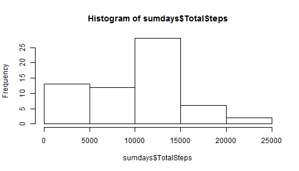
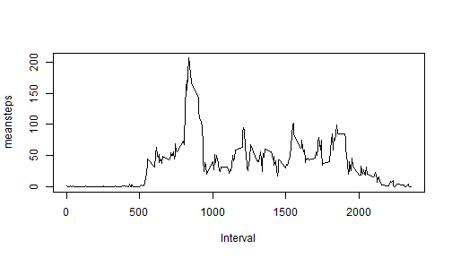
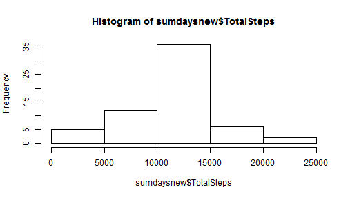
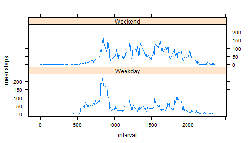

Reproducible Research Peer Assessment-1
========================================================

This R Markdown file explains the R code, along with the actual code and the output.

Steps carried out in part1-load and process data 
-Downloaded and saved the data as activity.csv in the working directory
-Converted the date to date format from factor


```r
setwd('C:/E_Drive/Coursera/05_Reproducible Research/peer 1')
rawdata<-read.csv("activity.csv")
rawdata$date<-as.Date(as.character(rawdata$date))
```

Steps carried out in part2-mean total number of steps taken per day
-The total number of steps each day is calculated using aggregate function and grouping by the date
-The missing values are ignored using na.rm=TRUE

-The histogram is then created

-The total number of steps in each date is available in sumdays dataset
-The mean and median are then calculated using appropriate functions

```r
sumdays<-aggregate(rawdata$steps,by=list(rawdata$date),FUN=sum,na.rm=TRUE)
names(sumdays)<-c("Date","TotalSteps")
```

```r
hist(sumdays$TotalSteps)
```

 

```r
meanperday<-mean(sumdays$TotalSteps)
print("Mean number of steps taken per day is:")
```

```
## [1] "Mean number of steps taken per day is:"
```

```r
print(meanperday)
```

```
## [1] 9354
```

```r
medianperday<-median(sumdays$TotalSteps)
print("Median number of steps taken per day is:")
```

```
## [1] "Median number of steps taken per day is:"
```

```r
print(medianperday)
```

```
## [1] 10395
```
Steps carried out in part3-average daily pattern
-The mean number of steps in each interval across all days is calculated using aggregate function and grouping the steps by the interval
-The missing values are ignored using the na.rm=TRUE option

-The mean in each interval is then plotted against the interval

-The interval which has the maximum of average steps is then extracted from the dataset using logical comparison


```r
meaninterval<-aggregate(rawdata$steps,by=list(rawdata$interval),FUN=mean,na.rm=TRUE)
names(meaninterval)<-c("interval","meansteps")
```

```r
plot(meaninterval$interval,meaninterval$meansteps,type='l',xlab='Interval',ylab='meansteps')
```

 

```r
maximumstepinterval<-meaninterval[meaninterval$meansteps==max(meaninterval$meansteps),1]
print("The interval that contains maximum number of steps is:")
```

```
## [1] "The interval that contains maximum number of steps is:"
```

```r
print(maximumstepinterval)
```

```
## [1] 835
```
Steps carried out in part4-imputing missing values
-Using complete.cases function the dataset is subsetted for missing values
-The total number is tehn determined using nrow
-The strategy to filling missing values is using the mean steps in that interval
for missing values
-The merge function is used to use the mean values from the missing values
-This dataset is then merged with the raw data set and then the missing values are removed. They are then ordered to retain the original order
-Again the aggregate function is used to recalculate the total number of steps

-The new total number of steps each day are plotted

-The mean and median are recalculated


```r
dataNA<-rawdata[!complete.cases(rawdata$steps),]
nrow(dataNA)
```

```
## [1] 2304
```

```r
new<-merge(dataNA,meaninterval,by="interval")
new$steps<-new$meansteps
new<-new[,1:3]
new<-new[,c(2,3,1)]

replacedNA<-rbind(rawdata,new)
replacedNA<-replacedNA[complete.cases(replacedNA),]
replacedNA<-replacedNA[order(replacedNA$date,replacedNA$interval),]

sumdaysnew<-aggregate(replacedNA$steps,by=list(replacedNA$date),FUN=sum)
names(sumdaysnew)<-c("Date","TotalSteps")
```

```r
hist(sumdaysnew$TotalSteps)
```

 

```r
meanperdaynew<-mean(sumdaysnew$TotalSteps)
print("The new mean steps per day is:")
```

```
## [1] "The new mean steps per day is:"
```

```r
print(meanperdaynew)
```

```
## [1] 10766
```

```r
medianperdaynew<-median(sumdaysnew$TotalSteps)
print("The new median steps per day is:")
```

```
## [1] "The new median steps per day is:"
```

```r
print(medianperdaynew)
```

```
## [1] 10766
```
####answer question????

Steps carried out in part5-activity pattern between weekdays and weekends
-Weekdays function is used to find the day of the week.
-Then based on the day the factor variable is assigned
-The new means across each interval is calculated by grouping the dataset based on weekday/weekend

-The data is then plotted using the lattice plotting system


```r
replacedNA$day<-weekdays(replacedNA$date)

replacedNA$final[replacedNA$day=="Monday"|replacedNA$day=="Tuesday"|replacedNA$day=="Wednesday"|replacedNA$day=="Thursday"|replacedNA$day=="Friday"]<- "Weekday"
replacedNA$final[replacedNA$day=="Saturday"|replacedNA$day=="Sunday"]<- "Weekend"

meaninterval_new<-aggregate(replacedNA$steps,by=list(replacedNA$interval,replacedNA$final),FUN=mean)
names(meaninterval_new)<-c("interval","final","meansteps")
```

```r
library(lattice)
xyplot(meansteps ~ interval | final, data = meaninterval_new,type='l',layout = c(1, 2))
```

 


